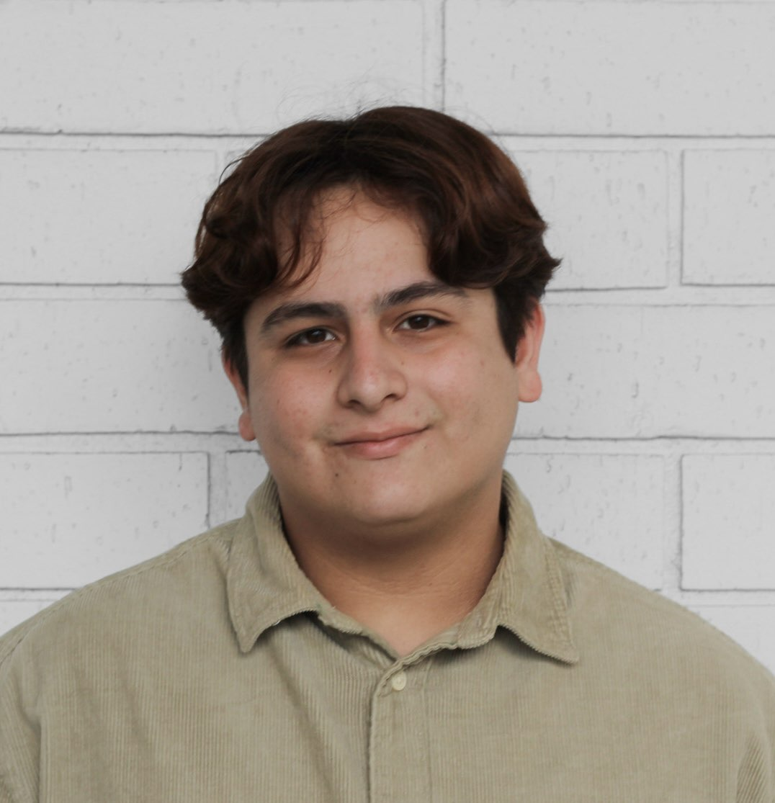
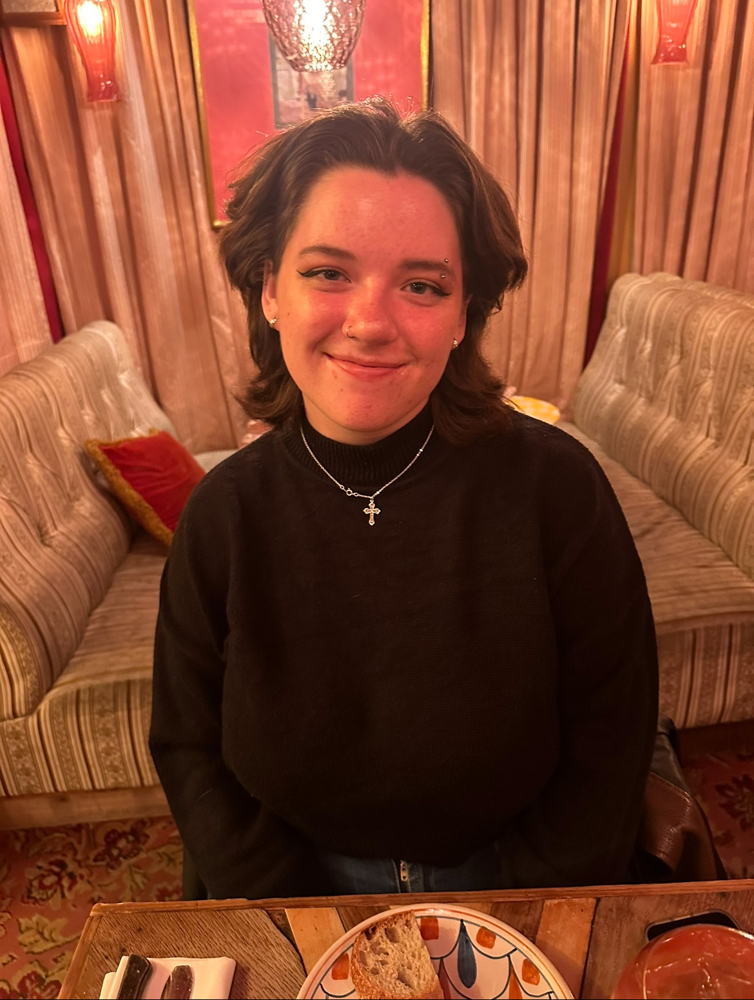
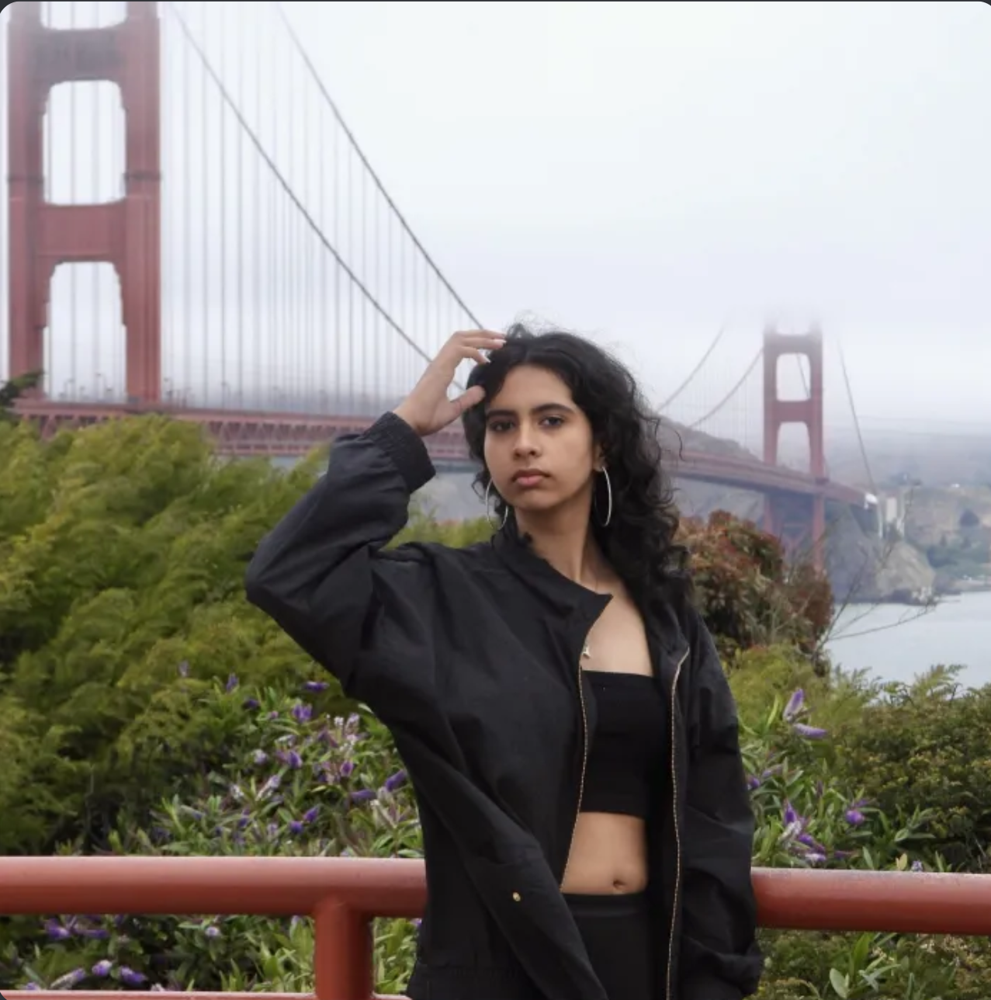
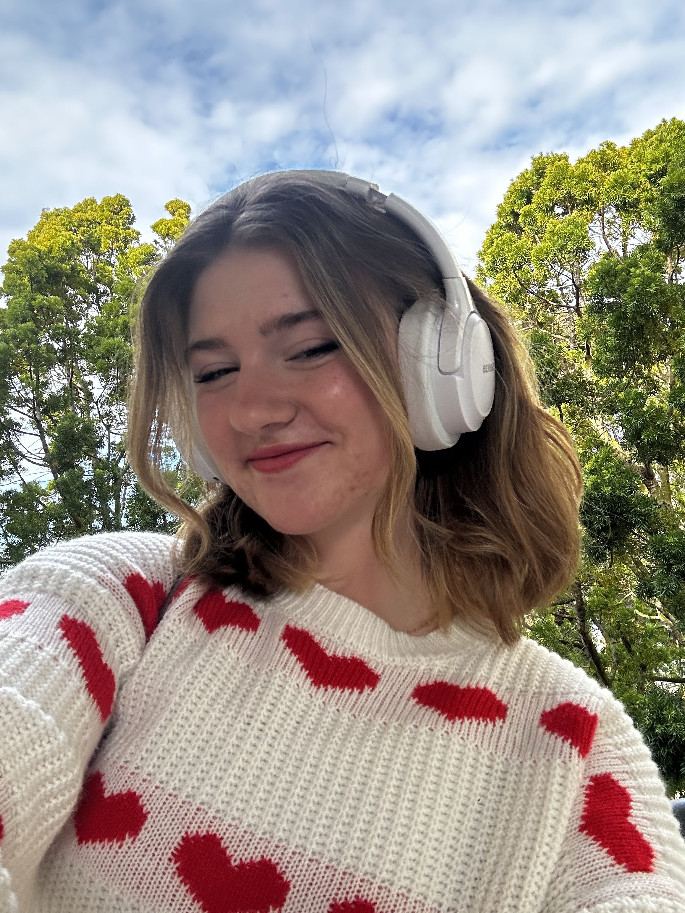
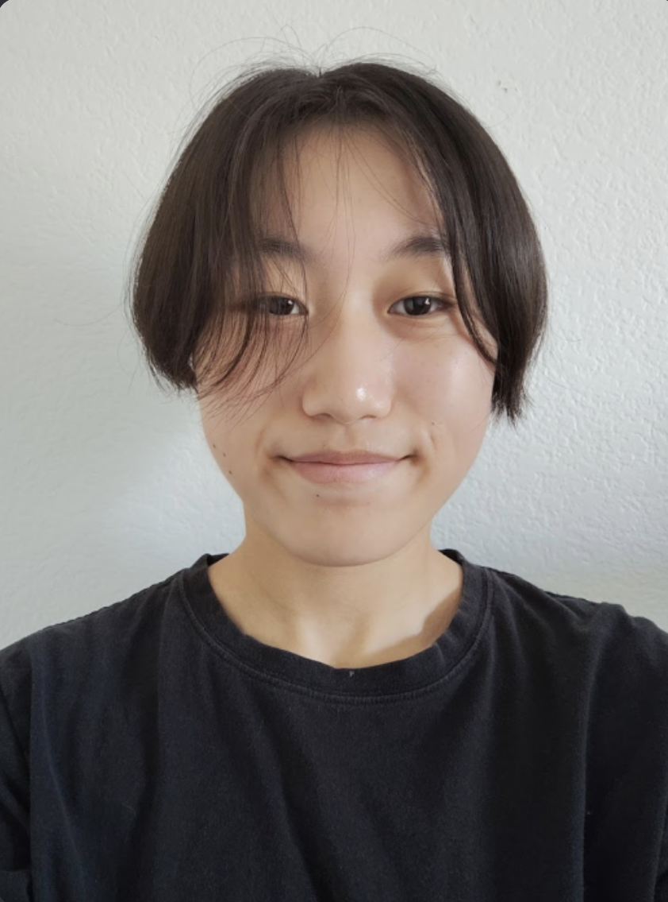
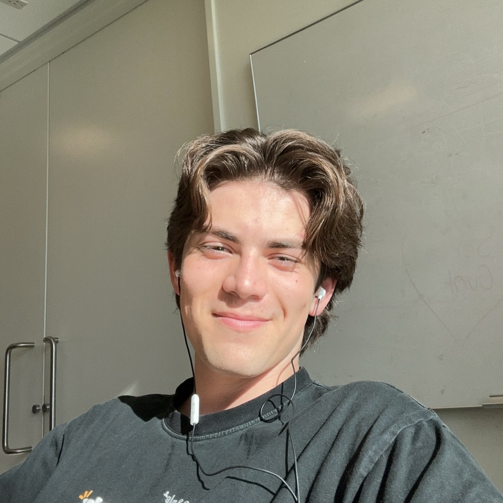
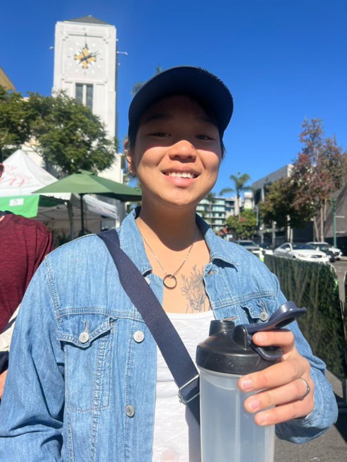
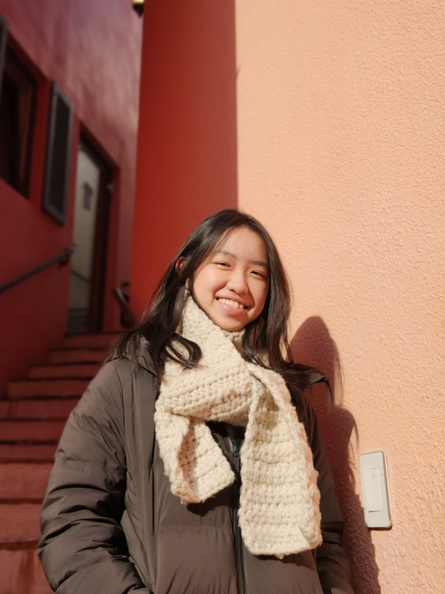
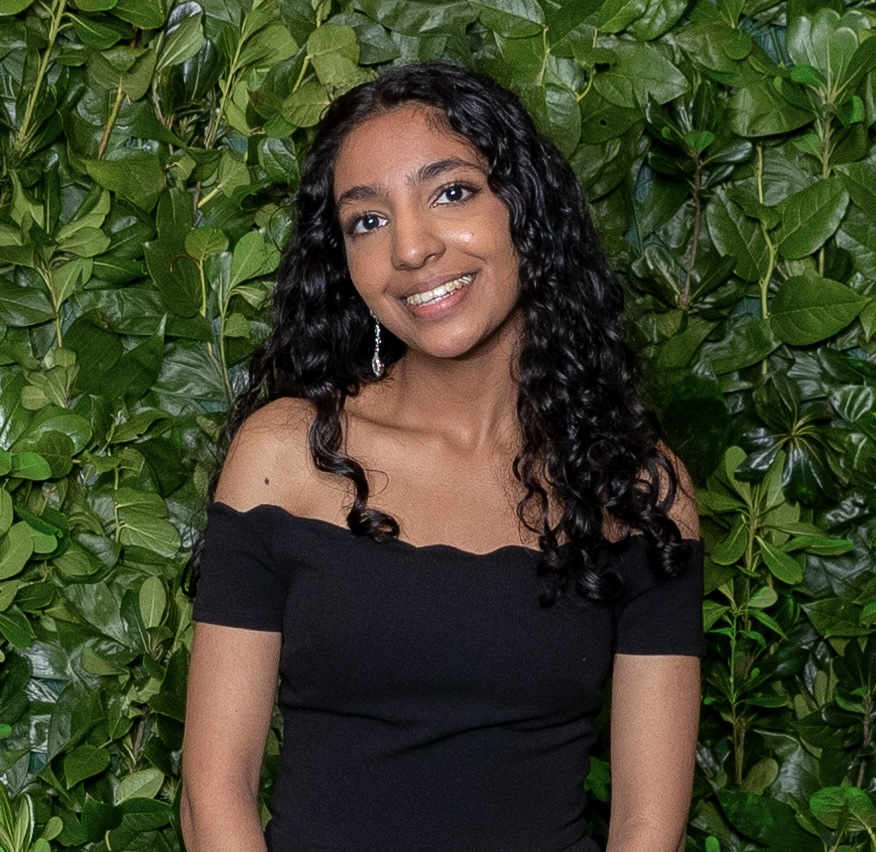

[comment]: <> (President)
<figure>
  
  <figcaption>
    President  
    he/him/his  
    Major: Cognitive & Behavioral Neuroscience  
    Class of 2026   
  </figcaption>
</figure>

<figure>

      <figcaption>
        Co-Vice President External  
        they/them  
        Major: Biological Anthropology & Social Psychology  
        Class of 2026   
      </figcaption>
</figure>

<figure>

        <figcaption>
          Co-Vice President External  
          she/her  
          Major: Math - Computer Science  
          Class of 2027   
        </figcaption>
</figure>

[comment]: <> (VPE)
<figure>
  
  <figcaption>
    Vice President of Finance  
    she/her/hers  
    Major: Chemical Engineering  
    Class of 2027   
  </figcaption>
</figure>

<figure>

    <figcaption>she/her   
      Major: Molecular & Cell Biology   
      Class of 2028
    </figcaption>
</figure>

<figure>

         <figcaption>he/him/his   
            Major: Human Biology   
            Class of 2026
          </figcaption>
</figure>

<figure>

         <figcaption>they/she   
            Major: Human Biology   
            Class of 2027
          </figcaption>
</figure>

<figure>

          <figcaption>they/them/he/him   
            Major: Electrical Engineering   
            Class of 2024
          </figcaption>
</figure>

<figure>

          <figcaption>she/they   
            Major: Human Biology   
            Class of 2028
          </figcaption>
</figure>

<figure>

          <figcaption>she/her/hers   
            Major: Computer Science - Bioinformatics   
            Class of 2027
          </figcaption>
</figure>

### Open Positions:

There are no open board positions but if you are interested please check this page for additional updates and attend events which can be found on our Home page. 
